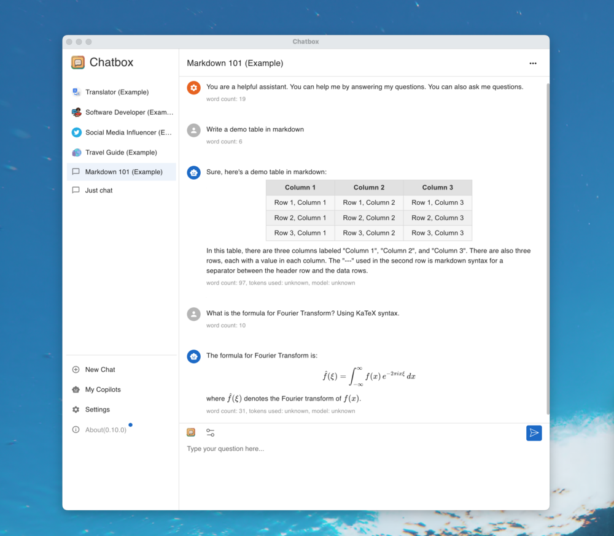
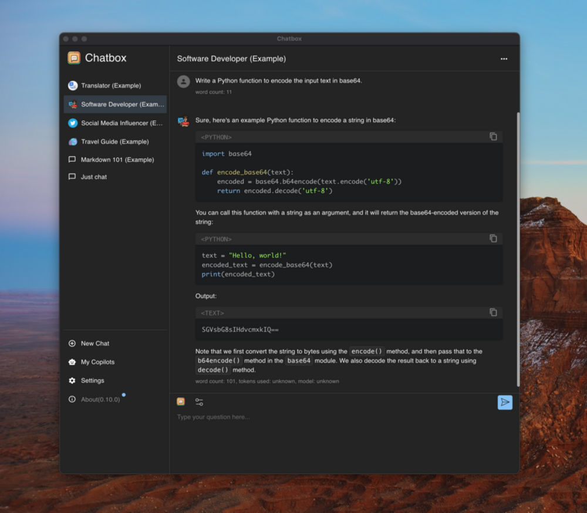

<p align="right">
  <a href="README.md">English</a> |
  <a href="./doc/README-CN.md">简体中文</a>
</p>

<h1 align="center">

<span>
    Chatbox
    <span style="font-size:8px; font-weight: normal;">(Community Edition)</span>
</span>
</h1>
<p align="center">
    <em>Your Ultimate AI Copilot on the Desktop. <br />Chatbox is a desktop client for ChatGPT, Claude and other LLMs, available on Windows, Mac, Linux</em>
</p>

<p align="center">
<a href="https://github.com/chatboxai/chatbox/releases" target="_blank">

</a>
<a href="https://github.com/chatboxai/chatbox/releases" target="_blank">

</a>
<a href="https://github.com/chatboxai/chatbox/releases" target="_blank">

</a>
<a href="https://github.com/chatboxai/chatbox/releases" target="_blank">

</a>
<a href="#features">

</a>
</p>

<p align="center">
<a href="https://www.producthunt.com/posts/chatbox?utm_source=badge-featured&utm_medium=badge&utm_souce=badge-chatbox" target="_blank"></a>
<a href="https://trendshift.io/repositories/14871" target="_blank"></a>
</p>

<p align="center">
  <a href="./doc/statics/snapshot_light.png">
    
  </a>
  <a href="./doc/statics/snapshot_dark.png">
    
  </a>
</p>

<div align="center" markdown="1">
  <strong>Sponsored by Warp</strong>
  <br>
  <br>
  <a href="https://go.warp.dev/chatbox">
    
  </a>

### [Warp, built for coding with multiple AI agents.](https://go.warp.dev/chatbox)
[Available for MacOS, Linux, & Windows](https://go.warp.dev/chatbox)<br>
</div>

---

This is the repository for the Chatbox Community Edition, open-sourced under the GPLv3 license.

[Chatbox is going open-source Again!](https://github.com/chatboxai/chatbox/issues/2266)

We regularly sync code from the pro repo to this repo, and vice versa.

## Download

### Desktop

<table style="width: 100%">
  <tr>
    <td width="25%" align="center">
      <b>Windows</b>
    </td>
    <td width="25%" align="center" colspan="2">
      <b>MacOS</b>
    </td>
    <td width="25%" align="center">
      <b>Linux</b>
    </td>
  </tr>
  <tr style="text-align: center">
    <td align="center" valign="middle">
      <a href='https://chatboxai.app/?c=download-windows'>
        
        <br />
        <b>Setup.exe</b>
      </a>
    </td>
    <td align="center" valign="middle">
      <a href='https://chatboxai.app/?c=download-mac-intel'>
        
        <br />
        <b>Intel</b>
      </a>
    </td>
    <td align="center" valign="middle">
      <a href='https://chatboxai.app/?c=download-mac-aarch'>
        
        <br />
        <b style="white-space: nowrap;">Apple Silicon</b>
      </a>
    </td>
    <td align="center" valign="middle">
      <a href='https://chatboxai.app/?c=download-linux'>
        
        <br />
        <b>AppImage</b>
      </a>
    </td>
  </tr>
</table>

### iOS/Android

<a href='https://apps.apple.com/app/chatbox-ai/id6471368056' style='margin-right: 4px'>

</a>
<a href='https://play.google.com/store/apps/details?id=xyz.chatboxapp.chatbox' style='margin-right: 4px'>

</a>
<a href='https://chatboxai.app/install?download=android_apk' style='margin-right: 4px; display: inline-flex; justify-content: center'>

.APK
</a>

For more information: [chatboxai.app](https://chatboxai.app/)

## Quick Start

### For End Users
1. Download the appropriate installer for your platform from the [releases page](https://github.com/chatboxai/chatbox/releases)
2. Install and launch Chatbox
3. Configure your AI provider (OpenAI, Claude, etc.) in settings
4. Start chatting!

### System Requirements

| Platform | Minimum Version | Architecture |
|----------|----------------|--------------|
| Windows | Windows 10 | x64 |
| macOS | macOS 11 (Big Sur) | Intel/Apple Silicon |
| Linux | Ubuntu 20.04+ / AppImage supported distros | x64 |

<!-- <table>
<tr>
<td>

</td>
<td>

</td>
</tr>
</table> -->

## Features

### 🤖 AI Model Support
-   **Support for Multiple LLM Providers**  
    :gear: Seamlessly integrate with a variety of cutting-edge language models:
    -   OpenAI (ChatGPT)
    -   Azure OpenAI
    -   Claude
    -   Google Gemini Pro
    -   Ollama (enable access to local models like llama2, Mistral, Mixtral, codellama, vicuna, yi, and solar)
    -   ChatGLM-6B

-   **Image Generation with Dall-E-3**  
    :art: Create the images of your imagination with Dall-E-3.

-   **Enhanced Prompting**  
    :speech_balloon: Advanced prompting features to refine and focus your queries for better responses.

### 🖥️ User Experience
-   **Local Data Storage**  
    :floppy_disk: Your data remains on your device, ensuring it never gets lost and maintains your privacy.

-   **No-Deployment Installation Packages**  
    :package: Get started quickly with downloadable installation packages. No complex setup necessary!

-   **Ergonomic UI & Dark Theme**  
    :new_moon: A user-friendly interface with a night mode option for reduced eye strain during extended use.

-   **Keyboard Shortcuts**  
    :keyboard: Stay productive with shortcuts that speed up your workflow.

-   **Streaming Reply**  
    :arrow_forward: Provide rapid responses to your interactions with immediate, progressive replies.

### 📄 Content & Formatting
-   **Markdown, Latex & Code Highlighting**  
    :scroll: Generate messages with the full power of Markdown and Latex formatting, coupled with syntax highlighting for various programming languages, enhancing readability and presentation.

-   **Prompt Library & Message Quoting**  
    :books: Save and organize prompts for reuse, and quote messages for context in discussions.

### 👥 Collaboration & Sharing
-   **Team Collaboration**  
    :busts_in_silhouette: Collaborate with ease and share OpenAI API resources among your team. [Learn More](./team-sharing/README.md)

### 🌐 Platform Availability
-   **Cross-Platform Desktop**  
    :computer: Chatbox is ready for Windows, Mac, and Linux users.

-   **Web Version**  
    :globe_with_meridians: Use the web application on any device with a browser, anywhere.

-   **Mobile Apps**  
    :phone: Native iOS and Android applications for on-the-go access.

### 🌍 Localization
-   **Multilingual Support**  
    :earth_americas: Catering to a global audience by offering support in multiple languages:
    -   English
    -   简体中文 (Simplified Chinese)
    -   繁體中文 (Traditional Chinese)
    -   日本語 (Japanese)
    -   한국어 (Korean)
    -   Français (French)
    -   Deutsch (German)
    -   Русский (Russian)
    -   Español (Spanish)

### ✨ More Features
-   **And More...**  
    :sparkles: Constantly enhancing the experience with new features!

## FAQ

-   [Frequently Asked Questions](./doc/FAQ.md)

## How to Contribute

We welcome contributions from the community! Here's how you can help make Chatbox better:

### 🐛 Reporting Issues
- Use [GitHub Issues](https://github.com/chatboxai/chatbox/issues) to report bugs or request features
- Before creating a new issue, please search existing issues to avoid duplicates
- Provide detailed information including steps to reproduce, expected behavior, and screenshots if applicable

### 🔧 Pull Requests
1. Fork the repository and create your branch from `main`
2. Make your changes and ensure the code follows our coding standards
3. Test your changes thoroughly
4. Update documentation if needed
5. Submit a pull request with a clear description of the changes

### 🌍 Translations
Help make Chatbox accessible to more people by contributing translations:
- Translation files are located in the `src/locales` directory
- Follow the existing translation format
- Submit a PR with your translation improvements

### 📖 Documentation
- Improve README, API documentation, or user guides
- Fix typos or clarify unclear instructions
- Add examples and tutorials

### 🌟 Other Ways to Contribute
- Star the repository to show your support
- Share Chatbox with others
- Answer questions in [GitHub Discussions](https://github.com/chatboxai/chatbox/discussions)
- Provide feedback and suggestions

**Thank you for contributing! 🙏**

## Development

### Prerequisites

Before you begin, ensure you have the following installed:

- **Node.js** (v20.x – v22.x) - [Download here](https://nodejs.org/)
- **pnpm** (v10.x or later) - Install via `corepack enable && corepack prepare pnpm@latest --activate`
- **Git** - [Download here](https://git-scm.com/)

### Quick Setup

1. **Clone the repository**
   ```bash
   git clone https://github.com/chatboxai/chatbox.git
   cd chatbox
   ```

2. **Install dependencies**
   ```bash
   pnpm install
   ```

3. **Start development server**
   ```bash
   pnpm run dev
   ```
   The application will start in development mode with hot-reload enabled.

### Build Commands

| Command | Description |
|---------|-------------|
| `pnpm run dev` | Start development server with hot-reload |
| `pnpm run package` | Build and package for current platform |
| `pnpm run package:all` | Build and package for all platforms |
| `pnpm run build` | Build for production without packaging |
| `pnpm run lint` | Run Biome to check code quality |
| `pnpm run test` | Run Vitest test suite |

### Project Structure

```
chatbox/
├── src/
│   ├── main/               # Electron main process
│   ├── renderer/           # React renderer (UI)
│   ├── preload/            # Electron preload scripts
│   └── shared/             # Shared utilities
├── doc/                    # Documentation and assets
├── resources/              # App resources and icons
├── team-sharing/           # Team collaboration features
└── package.json            # Project configuration
```

### Development Tips

- Use `pnpm run lint` before committing to ensure code quality
- Follow the existing code style and patterns
- Test your changes on both light and dark themes
- Ensure cross-platform compatibility when making UI changes

### Troubleshooting

**Issue**: `pnpm install` fails
- **Solution**: Ensure you're using pnpm (not npm or yarn) and Node.js version is within the required range. Run `corepack enable` if pnpm is not found.

**Issue**: Build fails on Windows
- **Solution**: Run `pnpm config set script-shell "C:\\Program Files\\git\\bin\\bash.exe"` if using Git Bash

**Issue**: Changes not reflecting in development
- **Solution**: Stop the dev server, delete `node_modules/.vite`, and restart

## Star History

[](https://star-history.com/#chatboxai/chatbox&Date)

## Contact

[Email](mailto:hi@chatboxai.com)

## License

[LICENSE](./LICENSE)
